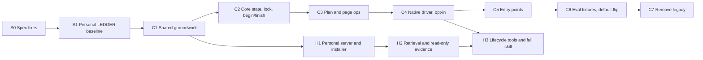

# Personal Mode Implementation Plan

This plan sequences the work in two specs:

- [`specs/personal-lifecycle-core.md`](specs/personal-lifecycle-core.md), referred to below as **core**;
- [`specs/personal-host-mode.md`](specs/personal-host-mode.md), referred to below as **host**.

Host depends on core (`depends_on` in its front matter), so the core work
comes first. Some host work does not need the full core and can run in
parallel. Every conformance check (PLC-001 to PLC-019, PHM-001 to PHM-018)
belongs to exactly one milestone, listed below.

Before any of that, S1 covers today's personal mode with LEDGER benchmarks and
fixtures, the same way code mode is covered. Every later milestone is then
measured against that baseline. S2, which makes onboarding run init only, is
independent and can ship at any time.

## Status

- [x] **S0. Spec fixes.** Both specs are at 0.2.
  - [x] S0.1 `status` ships early with core fields `null` (host §3.2, §3.4)
  - [x] S0.2 `ingest` moved to the lifecycle stage (host §3.2)
  - [x] S0.3 Translation middleware deleted with the legacy path (core §3.5)
  - [x] S0.4 Opt-in flag `OPENWIKI_PERSONAL_CORE=1` (core §3.5)
  - [x] S0.5 PHM-001 and PHM-005 check the shipped stage (host §5.1)
  - [x] S0.6 Fixtures named as personal LEDGER benchmarks, with a
        per-benchmark release gate (core §3.5, §6)
  - [x] S0.7 Onboarding entry point runs `begin(init)` (core §3.5)
- [ ] **S1.** Personal LEDGER baseline
  - [x] S1.1 `personal` benchmark kind, loader, and validation
  - [x] S1.2 `inbox-week` and `cross-source` fixture builders and trap
        manifests, with a connector round-trip shape test
  - [x] S1.3 Raw-timeline replay, child-process system adapter, and the
        injectable connector registry in `runOpenWikiIngestion`
  - [x] S1.4 Raw evidence adapter and `dated-evidence` grounding, with a
        personal gold calibration set
  - [x] S1.5 Trap-driven forgetting and structural checks in the report
  - [ ] S1.6 Live gold calibration and the three-run legacy baseline in
        `evals/ledger/README.md`. Deferred for cost: one partial
        `inbox-week` run (about 5% supported) is recorded instead.
- [ ] **S2.** Onboarding runs init only
- [x] **C1.** Shared groundwork
  - [x] C1.1 `generation/shared/`: `withRunMutation`, JSON state helpers,
        pending-job lookup, Markdown page snapshot and restore
  - [x] C1.2 `agent/page-workers.ts`: worker pool, `runPageAgent`,
        `streamWorkerTools`, `NO_DELEGATION_MIDDLEWARE`
  - [x] C1.3 Page prefix parameter for Claims paths, `ClaimsStore`, and
        retrieval
  - [x] C1.4 `writableWikiPages` enforced in `local-wiki` (PLC-003)
  - The S1 score check is skipped while S1.6 is deferred.
- [x] **C2.** Core state, lock, begin and finish
  - [x] C2.1 `personal-run-state.ts`: `.run.json` (`kind: "personal"`),
        `.synthesis-cursor.json`, and the `raw://` ref parser
  - [x] C2.2 `personal-run-lock.ts`: `.run.lock` with exclusive create,
        renewal, expiry, takeover, and release
  - [x] C2.3 `personal-run.ts`: frontier, `beginPersonalRun`,
        `closePersonalGathering`, `finishPersonalRun`
  - [x] C2.4 State files excluded from content snapshots
  - An in-scope agentic connector always gets an unfrozen frontier entry,
    so an update with one is never a no-op: gathering may still find
    evidence.
  - PLC-013's "scheduled ingestion never takes over" is an entry-point
    property and is checked with C5.
- [x] **C3.** Plan and page operations
  - [x] C3.1 `personal-run-plan.ts`: plan validation, required jobs, seed
        merging, and tier ordering
  - [x] C3.2 `submitPersonalPlan` and `nextPersonalPage` (with
        `pageVersion`, and Active entries and `changedPages` for a
        maintenance job)
  - [x] C3.3 Snapshot, restore, skip, and `submitPersonalPage`
  - [x] C3.4 Page change check: `writePersonalPage`, `editPersonalPage`, and
        `readPersonalPageVersion` take or report the `baseVersion`, and
        repair front matter after each write
  - The plan also rejects deleting a source page that receives this run's
    evidence, deletions outside `scope.pages`, and hidden path segments.
  - `/open-questions.md` is a maintenance job only while it carries no
    seeds. A planner that seeds it makes it a regular job.
- [x] **C4.** Native driver, opt-in
  - [x] C4.1 `agent/prompts/personal-guidance.ts`: canonical-page formats,
        confidence and contested rules, email triage, and
        `createConnectorSynthesisGuidance`. The legacy init and update
        prompts are assembled from it, byte-identical to before.
  - [x] C4.2 `agent/personal-runner.ts`: gather worker, planner, and one page
        worker per job on the shared worker pool, with the lock renewed on a
        timer and released on failure
  - [x] C4.3 Frontier-bounded raw read tools (`raw://` refs with JSON
        pointers), MCP gather tools scoped to the open connectors, and a page
        backend that tracks `baseVersion` from job start, its own writes, and
        its last stable read
  - [x] C4.4 `OPENWIKI_PERSONAL_CORE=1` routes
        `openwiki personal --init/--update` to the driver. Per-source
        ingestion and chat stay on the legacy path until C5.
  - A run with no evidence and no request submits an empty plan without a
    planner, so init on a fresh home runs only the `/quickstart.md` job.
  - CLI progress events carry `wiki: "personal"` and a `gathering` stage.
- [ ] **C5.** Entry-point rewiring
- [ ] **C6.** Default flip
- [ ] **C7.** Remove the legacy path
- [x] **H1.** Personal server and installer components
  - [x] H1.1 `createMcpServer` takes a name, instructions, and tool
        provider; `openwiki mcp personal --host <id>` serves
        `openwiki-personal` from a tool-less `PersonalSessionManager`
  - [x] H1.2 Installer components: `--personal` (user scope only),
        per-component skill, server key, and receipt; `integrations list`
        reports one row per host and component
  - [x] H1.3 Skill skeleton `integrations/openwiki-personal/`
  - [x] H1.4 Scoped connector environment, loaded on the first fetching
        call, with model-provider keys excluded from every `.env` load
  - [x] H1.5 `openwiki auth <provider>` connects a `sourceInstance`
- [x] **H2.** Retrieval and read-only evidence
  - [x] H2.1 Fixed retrieval targets in `src/retrieval/wiki.ts`: search,
        section and whole-page reads (with `version`), and `list_pages`,
        without workspace resolution; every front-matter `resource` is
        searchable
  - [x] H2.2 `ClaimsStore` refuses a symlinked wiki directory when it is the
        store root (page prefix `/`)
  - [x] H2.3 The six tools on `openwiki-personal`, in §3.2 order; `status`
        reports env presence only, never loads the connector environment, and
        returns the core fields as `null` until H2.6
  - [x] H2.4 Raw reads in the untrusted envelope, with the 500 KB cap and
        symlink refusal
  - [x] H2.5 Retrieval guidance and the four required statements in
        `SKILL.md` and the personal INSTRUCTIONS
  - The read-only tools are not under the single-operation guard, as in code
    mode. The guard serializes the H3 lifecycle tools.
  - [x] H2.6 Follow-up after C2: `status` reads the core state formats and
        fills `synthesisCursor`, `pending`, and `activeRun`
- [ ] **H3.** Lifecycle tools and full skill

## Order

There are two tracks after C1:

- **Core track:** C2 → C7.
- **Host track:** H1 → H2. These two milestones need only C1. H3 then joins
  both tracks.

The first user-visible result is the end of H2: a host can answer questions
from the personal wiki.

---

## S0. Spec fixes (before code)

Fix these gaps in the specs before implementation starts. Each one changes
what a milestone builds.

1. **`status` needs core data.** Host §3.2 says `openwiki_personal_status`
   needs nothing from the core ("Core required: no"). But host §3.4 has it
   return the synthesis cursor, the number of pending raw runs, and the active
   run with its lock holder. All three use core §3.2 formats. Proposed fix:
   change the column to "state formats", and let H2 ship `status` with those
   three fields set to `null` until C2 lands.
2. **`ingest` must not ship before the core.** The table puts it in the
   early-shipping set. Today `openwiki ingest` synthesizes only the raw files of
   its own pull (`src/ingestion/ingestion.ts`, "Raw data files" in the source
   prompt). A host-triggered pull would therefore never be synthesized by the
   legacy path. The first core run takes only the newest raw run per connector
   (core §3.2), so if several host pulls happen first, all but the newest are
   lost. Proposed fix: move `openwiki_personal_ingest` to the lifecycle tools
   (H3), and note the reason under host §3.2 "Delivery staging".
3. **Deleting the translation middleware conflicts with keeping the legacy
   path.** Core §3.5 deletes the translation middleware because "personal
   init/update is its only caller". But the legacy monolithic path, which stays
   available behind `OPENWIKI_PERSONAL_LEGACY=1`, is that caller
   (`src/agent/index.ts`). Proposed fix: delete the middleware in C7, together
   with the legacy path.
4. **Name the opt-in for the new native driver.** Core §3.5 forbids making the
   new driver the default before the evaluation fixtures exist. It names a flag
   for the legacy path, but none for opting in to the new driver during
   C4–C5. Proposed: `OPENWIKI_PERSONAL_CORE=1` until C6, then the default, with
   `OPENWIKI_PERSONAL_LEGACY=1` to opt out.
5. **PHM-001 and PHM-005 fail on a staged server.** Both require exactly the
   §3.2 tool list, but staging permits a partial list. Proposed: describe
   them as "the registered tools are the §3.2 tools for the shipped stage, in
   §3.2 order".
6. **Point the core spec at the S1 benchmarks.** Core §3.5 and §6 refer to
   "the personal evaluation fixtures" without saying what they are. Name the
   S1 LEDGER benchmarks as those fixtures, and state the comparison rule C6
   uses.
7. **Add onboarding to the core spec's entry points.** The table in core
   §3.5 has no row for onboarding. Add one: personal onboarding runs
   `begin(init)` and never ingests (S2).

Bump both specs to 0.2 and record the changes in their §7 changelogs.

---

## S1. Personal LEDGER baseline (before C1)

**Goal:** a LEDGER score for today's legacy personal path, measured on frozen
synthetic connector data, so every later milestone can be checked against it.
Code mode has this today through `evals/ledger`; personal mode has no evals.

**Approach:** extend LEDGER rather than build a second harness. Personal runs
then get the same claim states, LEDGER score, report, `reevaluate`, and
offline test suite. LEDGER already has the seams this needs:

- `SystemUnderTest` (`core/types.ts`);
- `SourceEvidenceAdapter` (`source/source-adapter.ts`);
- `EvidenceRecord.sourceRef`, which already allows "message ID, or page ID".

What is Git-specific today:

- the replay (`replay/git-replay.ts`);
- the surface census (`benchmark/surface.ts`);
- the wiki location (`core/paths.ts`, `wikiDirFor` → `openwiki/`);
- the benchmark format (`commit` per checkpoint).

### What is built

1. **A benchmark kind.** `benchmark.json` gains `kind: "repository" |
"personal"`, with `"repository"` as the default so `calc` and `taskflow`
   don't change.
   - A personal checkpoint lists the raw runs it adds:
     `{ id, label, pulls: [{ connectorId, rawRunId }] }`.
   - Fixtures live in `benchmarks/<name>/raw/<connectorId>/<rawRunId>/`. They
     use the same file names and JSON shapes the real connectors write, for
     example `gmail-messages.json` and Slack's `my-recent-messages.json`.
2. **A deterministic fixture builder**, `benchmarks/<name>/build-fixtures.mjs`,
   following the pattern of `taskflow/build-repo.mjs`.
   - It uses fixed timestamps and ids, so a rebuild produces identical bytes.
   - All people, mail, and messages are synthetic. No real personal data is
     ever checked in.
   - It also writes an evaluator-only **trap manifest**. This is the personal
     version of the taskflow trap catalog: which facts each checkpoint plants,
     changes, or retires. It is never given to the system under test.
3. **Raw-timeline replay** (`replay/personal-replay.ts`).
   - Creates a temporary OpenWiki home inside the run workspace, with an
     `onboarding.json` listing the connected sources.
   - At each checkpoint, makes that checkpoint's pulls available.
   - Enforces realpath containment like `GitReplay`, so it never touches the
     user's `~/.openwiki`.
4. **A personal system adapter** (`system/openwiki-personal-system.ts`).
   - Runs each OpenWiki invocation in a **child process** with
     `OPENWIKI_CONFIG_DIR` set to the temporary home. This is required
     because `openWikiHomeDir` and the paths built from it are module-level
     constants (`src/config/openwiki-home.ts:40-46`). A child process also
     keeps the user's real `~/.openwiki/.env` out of the run. Provider
     credentials come from the parent environment, as they do for code-mode
     LEDGER.
   - **T0:** runs `openwiki personal --init` with no raw data, as onboarding
     will (S2). T0 has no evidence, so it gets the structural checks only and
     few or no claims. A benchmark's first pull happens at T1.
   - **Later checkpoints:** the user decides when to ingest, so each later
     checkpoint is one `openwiki ingest` of that checkpoint's pulls. They run
     `runOpenWikiIngestion` through a replay
     connector whose `ingest` returns that checkpoint's recorded pull instead
     of fetching. This exercises the real per-source prompt
     (`createSourceUpdateMessage`) and the real agent run.
   - **One small change to `src/`:** let `runOpenWikiIngestion` accept an
     injected connector registry. Today it calls `createConnectorRegistry()`
     directly (`src/ingestion/ingestion.ts:75`). Nothing else in `src/`
     changes.
5. **A raw evidence adapter** (`source/raw-evidence.ts`).
   - Produces one `EvidenceRecord` per item, such as one email or one Slack
     message. `sourceRef` is the item's `raw://<connectorId>/<rawRunId>/<file>#<pointer>`
     ref, the format core §3.2 uses for evidence refs.
   - Each record carries the item's date.
   - The corpus is cumulative: everything pulled up to the current checkpoint.
6. **Temporal grounding for the evaluator.** In code mode, "current" is the
   checkout and "historical" is earlier checkouts. In personal mode, older
   mail stays in the cumulative corpus, so an old deadline is both supported
   (by the old email) and contradicted (by the new one).
   - Add a grounding-prompt variant, selected by benchmark kind: the newest
     relevant dated evidence decides.
   - Contradicted by newer evidence and established by older evidence →
     `stale`. Established by nothing → `invented`. The four states and the
     score formula stay the same.
   - Calibrate the variant with the existing gold-agreement tooling
     (`meta/gold-agreement.ts`) on a hand-labelled claim set. This is the main
     risk in S1.
7. **Forgetting pass.** It is driven by the trap manifest instead of the code
   surface census, which has no personal equivalent. Facts the manifest marks
   as retired must disappear from current sections, for example a completed
   commitment that is still listed as Active.
8. **Model-free structural checks**, reported next to the score:
   - `/quickstart.md` exists, and every page's front matter passes
     `repairPersistedFile` without repair;
   - `.last-update.json` is `complete`;
   - no prompt-injection canary string reaches the wiki;
   - no file outside the wiki and connector raw directories changed in the
     temporary home;
   - newsletter and noise items planted by the builder do not get their own
     pages.

### Initial benchmarks

These mirror `calc` (small) and `taskflow` (hard):

- **`inbox-week`** (medium). Gmail only, 4 daily checkpoints. Traps:
  - a commitment that is created, then rescheduled, then completed;
  - a dentist appointment, which belongs in `/personal-logistics.md`, not in
    `/commitments.md`;
  - newsletter noise;
  - one email containing a prompt-injection canary;
  - a final checkpoint with no new mail, which tests no-op handling.
- **`cross-source`** (hard). Gmail and Slack, 5 checkpoints. Traps:
  - one project discussed in both sources;
  - a deadline the two sources disagree on (contested);
  - a person whose role changes;
  - a thread duplicated across both sources;
  - an open question raised and later answered;
  - a trip that is cancelled.

**Deferred:** Notion and `custom-mcp` need a local stub MCP server, because
both gather live during the run. `git-repo` is agentic until C5. Add
benchmarks for them after C5.

### Tests and validation

- The offline suite (`pnpm exec vitest run evals/ledger`) covers the personal
  replay, the raw evidence adapter, and the benchmark loader, using the
  existing deterministic system and evaluator stand-ins.
- A shape test checks that each fixture file matches what its connector
  writes, so fixtures can't drift from the real connectors.
- `pnpm run eval:ledger:typecheck` passes.

### Done when

- `pnpm run eval:ledger -- --benchmark evals/ledger/benchmarks/inbox-week`
  produces a score, and so does the `cross-source` benchmark.
- The legacy baseline (score, the four claim rates, and the structural checks,
  each over three runs) is recorded in the benchmarks' README.
- The fixtures can also be reused as unit-test fixtures for C2's frontier and
  cursor tests.

**After S1:** rerun both benchmarks after C1 (a refactor that should not move
the score), and after C4 and C5 with the opt-in flag set.

---

## S2. Onboarding runs init only

S2 is independent of everything else and can ship at any time. S1 already
models this flow, so it doesn't have to wait for S2.

Today, personal onboarding ends with the choice "Run ingestion now" or "Run
later" (`FINAL_OPTIONS`, `src/setup/credentials/constants.ts:264`). "Run
ingestion now" starts `ingest all` immediately (`src/cli/app/app.tsx:801`),
and personal init never runs.

The new flow:

- Completing personal onboarding runs `openwiki personal --init`. This
  creates the wiki skeleton without reading any connector data.
- For personal mode, the "Run ingestion now / Run later" step goes away.
  After init, onboarding tells the user how to seed the wiki when they're
  ready, for example `openwiki ingest <source>` or `openwiki ingest all`.
- Code mode's final step doesn't change.

Under the core (C5), this is `begin(init)` with an empty frontier: only the
required `/quickstart.md` job, and nothing to ingest.

**Checks:** update `test/setup/onboarding.test.ts` and the credentials step
tests to show that personal onboarding runs init and never starts ingestion.

---

## Core track

### C1. Shared groundwork (core §3.1)

A refactor-only change. The spec requires that it lands on its own.

- Move from `src/generation/repository-run.ts` and `src/generation/run-state.ts`
  into `src/generation/shared/`:
  - `withRunMutation` (`repository-run.ts:319`);
  - the atomic, schema-validated JSON state read and write helpers;
  - the pending-job lookup;
  - the Markdown-only page snapshot restore.
- Move from `src/agent/repository-runner.ts` into `src/agent/page-workers.ts`:
  - the worker pool with its rate-limit backoff;
  - `runPageAgent` (`:856`);
  - `streamWorkerTools` (`:1040`);
  - `NO_DELEGATION_MIDDLEWARE` (`:103`).

  Parameterize them by the core's `next`, `snapshot`, `restore`, `skip`, and
  `submit` functions.

- Take the wiki root and page prefix as parameters instead of hardcoding
  `/openwiki`. Code mode passes `/openwiki`. This applies to:
  - `src/claims/brains/code/paths.ts`;
  - `ClaimsStore` page discovery and reading;
  - `src/retrieval/wiki.ts`.
- Enforce `writableWikiPages` in `local-wiki` output mode
  (`src/agent/docs-only-backend.ts`, `getDocsOnlyWriteError`, which today
  returns `null` early for local-wiki).

**Checks:**

- **PLC-002:** `test/generation/*` and `test/agent/repository-runner.test.ts`
  pass with import-path edits only.
- **PLC-003:** a new case in `test/agent/docs-only-backend.test.ts`.
- Make sure `test/agent/personal-shell-boundary.test.ts` still passes. The
  local-wiki fix touches the same backend.
- The S1 benchmark scores stay within the baseline's run-to-run spread. While
  S1.6 is deferred, this check is skipped and the tests above carry C1.

**Risk:** this is the most heavily tested code in the repository. Keep the
change mechanical, and include no behavior change other than the local-wiki
write check.

### C2. Personal state, lock, begin and finish (core §3.2, §3.4)

Create `src/generation/personal-run.ts` and `src/generation/personal-run-state.ts`:

- **`PersonalRunState`** (`.run.json`, with `kind: "personal"`). Code-mode
  readers must reject a file with this `kind`.
- **Synthesis cursor** (`.synthesis-cursor.json`). A corrupt file fails with
  `invalid_state`.
- **Frontier computation:**
  - takes raw runs newer than each connector's cursor, or only the newest raw
    run when a connector has no cursor;
  - takes connectors from the connected `sourceInstances` in `onboarding.json`,
    narrowed by `scope.connectors`;
  - drops raw directories the user deleted, and adds a warning to the begin
    view.
- **The `raw://` evidence-ref parser.** It accepts an RFC 6901 pointer
  fragment and rejects refs outside the frontier.
- **Single-writer lock** (`.run.lock`):
  - created with exclusive create (`wx`);
  - a holder renews `renewedAt` on every operation;
  - a lock is expired after 30 minutes without renewal, or immediately when its
    holder is on this machine and the pid is dead;
  - a `takeover` deletes the expired lock and re-acquires it with exclusive
    create;
  - every operation except `begin` checks that the caller holds the lock.
- **`beginPersonalRun`:**
  - resolves the language;
  - acquires the lock, then resumes an existing run or creates a new one;
  - returns a no-op when there is nothing to do (no `.run.json` written);
  - runs `prepareWikiForAuthoring(local-wiki)`;
  - sets the phase to `gathering` or `planning`;
  - writes `.last-update.json` with status `interrupted`;
  - sets `languageChanged` and `requiredRewritePages`.
- **`closePersonalGathering`.**
- **`finishPersonalRun`:**
  - applies `deletePages`;
  - runs `finalizeWikiArtifacts`;
  - restores the snapshots of skipped jobs;
  - advances a connector's cursor only when every job seeded with its evidence
    completed;
  - writes `.last-update.json`;
  - deletes `.run.json`, then `.run.lock`;
  - can run again after a crash (idempotent).
- **Content snapshot exclusion.** Content snapshots must exclude the three
  state files.

**Checks:** PLC-001 (add an import-boundary test or lint rule), PLC-004,
PLC-005, PLC-006, PLC-010, PLC-012, PLC-013, PLC-014, and the core half of
PLC-019 (dead-pid expiry, release, then resume).

Tests go in `test/generation/personal-run.test.ts`, with fixture raw
directories under a temporary `OPENWIKI_CONFIG_DIR`.

### C3. Plan and page operations (core §3.3, §3.4)

- **`submitPersonalPlan`:**
  - validation: rejects duplicate paths, paths that are both planned and
    deleted, deletion of `/quickstart.md` or `/open-questions.md`, deletion of
    any page in init mode, seeds outside the frontier, pages outside
    `scope.pages`, dot segments, and the reserved pages;
  - adds the required jobs: `/sources/<id>.md`, `/open-questions.md` as a
    maintenance job, `/quickstart.md`, and the language rewrite jobs;
  - merges seeds into planner jobs that already cover a required page;
  - orders the queue by tier.
- **`nextPersonalPage`** returns `pageVersion` (`sha256:…` or `"absent"`). For a
  maintenance job, the view includes the page's Active entries and
  `changedPages`.
- **`capturePersonalPageSnapshot`, `restorePersonalPage`, and
  `skipPersonalPage`.** Skipped jobs return to `pending` on resume.
- **The page change check.** A write is rejected with `conflict` when its
  `baseVersion` doesn't match the page on disk. The native backend tracks the
  version implicitly; host tools pass it explicitly.
- **`submitPersonalPage`** requires the page to exist and pass
  `repairPersistedFile`, and is idempotent.

**Checks:** PLC-007, PLC-008, PLC-009, PLC-011 (a crash at each step), PLC-018,
and the core half of PLC-017.

### C4. Native personal driver, opt-in (core §3.5)

- Create `src/agent/prompts/personal-guidance.ts` as the single source for:
  - the canonical-file formats;
  - the confidence and contested rules;
  - email triage;
  - `createConnectorSynthesisGuidance`.

  Extract this content from `src/agent/prompts/personal.ts` and from the
  synthesis policy in `src/ingestion/ingestion.ts`. Remove the rules the core
  now enforces: ordering, required pages, `.last-update.json`, and indexes.

- Create `src/agent/personal-runner.ts` with three workers:
  - **Gather worker:** the MCP list and call tools plus `close_gathering`, with
    a read-only wiki;
  - **Planner:** read-only wiki tools, the raw read tools, and `submit_plan`;
  - **Page worker:** `writableWikiPages: [job.path]`, the raw read tools, and
    `submit_page`.

  None of the workers gets a shell, ingest tools, or delegation. They reuse
  `src/agent/page-workers.ts`, honor `OPENWIKI_PAGE_CONCURRENCY` (default 1),
  and renew the lock on a timer.

- Gate the driver behind the opt-in from S0.4. Without the opt-in,
  `openwiki personal --init/--update` keeps the legacy path.

**Checks:** PLC-015 (language rewrite jobs, no translation pass on the new
path), PLC-016, the native halves of PLC-017 and PLC-019.

### C5. Entry-point rewiring (core §3.5)

All of this goes behind the opt-in until C6.

- **`openwiki personal --init/--update [msg]`** calls `begin`, then the native
  driver.
- **`openwiki ingest <target>`** runs all requested pulls first, then exactly
  one `begin(update, scope.connectors)`, then the driver.
- **`openwiki ingest <target> --pull-only`** is new. It pulls only.
- **Scheduled ingestion** gets a pull-only schedule option. It never passes
  `takeover`.
- **`openwiki personal` chat** answers read-only. An edit request opens a
  one-page run with `scope.pages`.
- **The `git-repo` connector** becomes deterministic
  (`supportsAgenticDiscovery: false`).
- **Lock conflicts:** the CLI reports the lock holder or the mode/language
  mismatch and exits with a non-zero code, and `ingest` keeps its pulls. When
  the lock has expired, the CLI asks the user to confirm a takeover.

**Checks:**

- `test/ingest-all-connectors.test.ts` and `test/git-repo-connector.test.ts`
  are updated.
- A new test shows that ingest calls `begin` once for several targets.

### C6. Default flip

This milestone is the release gate in core §3.5. The fixtures come from S1.

- Add personal benchmarks for Notion (with a stub MCP server) and `git-repo`,
  which C5 made deterministic.
- Run every personal benchmark on the legacy path and on the new native path
  with `OPENWIKI_PERSONAL_CORE=1`, three runs each.
- Make the new path the default, and move the legacy path behind
  `OPENWIKI_PERSONAL_LEGACY=1`, once the new path's mean LEDGER score is at
  least the legacy one and no structural check regresses.

### C7. Remove the legacy path

This happens in the first minor release after C6.

- Delete the monolithic personal path.
- Delete `src/agent/translation-middleware.ts` and its test (S0.3).
- Remove the opt-in flag.

---

## Host track

### H1. Personal server and installer components (host §3.1)

This milestone can start as soon as C1 lands.

- Parameterize `src/integrations/mcp/server.ts` by server name, instructions,
  and tool provider.
- Add `openwiki mcp personal --host <id>`. It announces `openwiki-personal` and
  is backed by a `PersonalSessionManager` with a single-operation guard. It
  starts with no tools; H2 adds them.
- Refactor the installer (`src/integrations/install/registry.ts`,
  `skill-bundle.ts`, the three config adapters, and the receipt) into
  components. Today the code assumes one skill named `openwiki` and one server
  key named `openwiki`.
  - `install|uninstall <host> --personal` manages the personal component only.
  - `--personal --project` is rejected.
  - `integrations list` reports each component per host.
- Add the skill skeleton `integrations/openwiki-personal/` with `SKILL.md`,
  `agents/openai.yaml`, and `agents/bob.yaml`. The reference file comes in H3.
- Load the scoped connector environment on the first call to a fetching tool.
  Model-provider keys are never loaded.
- Make `openwiki auth <provider>` create or update a connected `sourceInstance`.

**Checks:** PHM-001 (staged form, S0.5), PHM-002, PHM-003, PHM-004, and the
skill half of PHM-017 (the code skill mentions no personal tool).

### H2. Retrieval and read-only evidence (host §3.2–§3.4 subset)

This milestone needs C1 for the layout parameterization.

- Tools:
  - `openwiki_personal_search`
  - `openwiki_personal_read` (the whole-page form returns `version`)
  - `openwiki_personal_list_pages`
  - `openwiki_personal_status` (S0.1)
  - `openwiki_personal_list_raw_items`
  - `openwiki_personal_read_raw_item`
- The personal target `{id: "personal", dir: openWikiLocalWikiDir, pagePrefix: "/"}`:
  - applies symlink and realpath containment;
  - excludes `index.md` and `log.md` from search and `list_pages`;
  - searches front-matter `resource` values;
  - takes no part in workspace resolution.
- Wrap raw results in the untrusted envelope. Keep the 500 KB cap and the
  symlink refusal.
- Write the retrieval-only part of `SKILL.md` and the personal INSTRUCTIONS,
  including the four required statements.

**Checks:** PHM-007, PHM-008, PHM-009 (for the tools shipped), PHM-012 (raw
half), and PHM-005 in its staged form.

**Follow-up after C2.** H2 can land before C2, so `status` first ships with
`synthesisCursor`, `pending`, and `activeRun` set to `null` (S0.1). Once C2
lands, `status` reads the core state formats (host §3.4) without calling a
core operation or taking the lock:

- `synthesisCursor` is the cursor's per-connector entries;
- `pending` counts, per connected connector, the raw runs the next run would
  consume, using the core's frontier rule (only the newest run when the
  connector has no cursor);
- `activeRun` is `.run.json`'s run ID, mode, phase, and start time, with the
  lock's holder, age, and expiry, or `null` for the lock when no process holds
  the run;
- a corrupt state file fails `status` with `invalid_state`.

### H3. Lifecycle tools and full skill (host §3.2, §3.4–§3.6)

This milestone needs C4 for `personal-guidance.ts`, and the native driver for
PHM-014.

- Lifecycle tools:
  - `begin` returns `briefs` and `openQuestions`;
  - `close_gathering`, `submit_plan`, `next_page`, `submit_page`, and `finish`.
- Page tools:
  - `write_page` and `edit_page` resolve the path from `jobId`, take a
    `baseVersion`, reject content over 512 KB, and run `repairPersistedFile`.
- Evidence tools:
  - `openwiki_personal_ingest`, held back to this milestone (S0.2);
  - the gathering proxy (`list_mcp_tools`, `call_mcp_tool`), which applies
    `getToolCallPolicy` and writes its raw runs inside the gathering window.
- Session end: when stdin closes and the run is unfinished, release the lock
  and keep `.run.json`.
- Generate `references/personal.md` from `personal-guidance.ts` at build time,
  and add a byte-equality test.
- Complete `SKILL.md`: the run sequence, the ban on native writes, and the
  handling of lock and page conflicts.

**Checks:** PHM-005 and PHM-001 (full form), PHM-006, PHM-010, PHM-011, PHM-012
(MCP half), PHM-013, PHM-014, PHM-015, PHM-016, the personal-skill half of
PHM-017, and PHM-018.

---

## Out of scope

These are deferred by the specs:

- Pi support;
- OAuth started by the host;
- host edits to non-secret config;
- model-free onboarding;
- personal Claims;
- a raw retention policy;
- per-instance cursors;
- workspace linking for the personal wiki;
- a read-side connector setting.

## Decisions needed

- The S1 temporal grounding rule: is "the newest relevant dated evidence
  decides" the right definition of `stale` for personal knowledge? This is
  the decision that most affects what the personal score means.
- The C6 flip rule: core 0.2 requires, on every benchmark, a mean score at
  least the legacy mean with no structural regression. Is a stricter margin
  needed?
